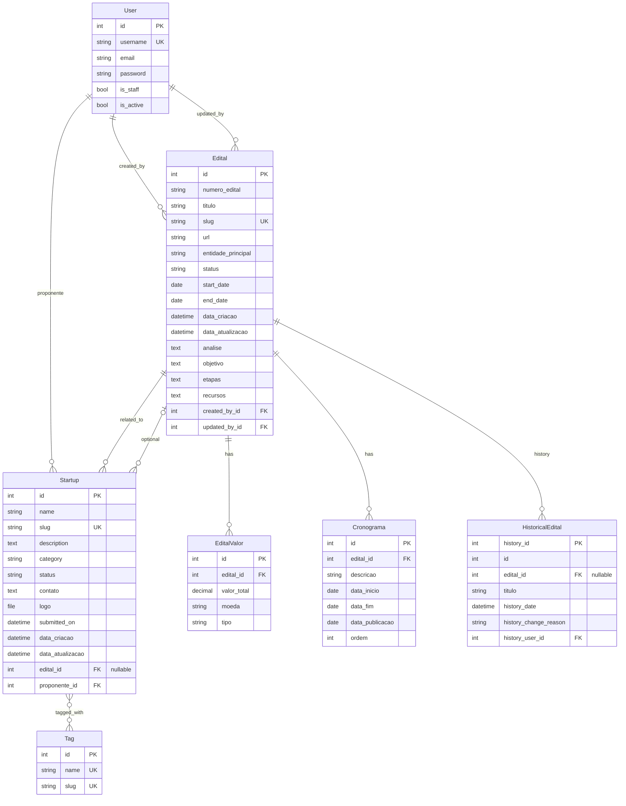

# Schema do Banco de Dados

Este documento descreve o schema completo do banco de dados do AgroHub.

## Diagrama ER (Entity-Relationship)

## Regras de Negócio do Schema

O schema foi desenhado para impor as seguintes regras de negócio fundamentais:

1.  **Integridade de Datas**:
    - Um edital não pode ser encerrado antes de ser aberto (`start_date <= end_date`).
    - Cronogramas devem seguir uma ordem lógica temporal.

2.  **Unicidade de Identificadores**:
    - **Slugs**: Editais e Startups possuem slugs únicos gerados automaticamente para garantir URLs amigáveis (SEO) e consistentes.
    - **Valores**: Um edital só pode ter *um* registro de valor total para cada moeda específica (constraint `unique_together`), evitando duplicidade de dados financeiros.

3.  **Auditoria e Rastreabilidade**:
    - Todas as modificações em `Edital` geram um registro na tabela `HistoricalEdital`, permitindo auditoria completa (quem mudou, quando, e o que mudou).
    - `created_by` e `updated_by` são mantidos mesmo se o usuário for deletado (`SET_NULL`), preservando o histórico da instituição.

4.  **Propriedade de Startups**:
    - Uma Startup deve ter um proponente (User). Se o usuário for deletado, suas startups também são removidas (`CASCADE`), pois a incubação está atrelada ao vínculo do proponente.

## Modelos Detalhados

### Edital

Modelo principal representando um edital de fomento.

**Campos Principais:**
- `id`: Primary Key (auto)
- `numero_edital`: Número do edital (opcional)
- `titulo`: Título do edital (max 500 chars)
- `slug`: URL amigável (único, auto-gerado)
- `url`: URL do edital original
- `entidade_principal`: Entidade responsável
- `status`: Status do edital (draft, aberto, fechado, etc.)
- `start_date`: Data de abertura
- `end_date`: Data de encerramento
- `data_criacao`: Data de criação (auto)
- `data_atualizacao`: Data de atualização (auto)

**Campos de Conteúdo (HTML):**
- `analise`: Análise do edital
- `objetivo`: Objetivo
- `etapas`: Etapas
- `recursos`: Recursos disponíveis
- `itens_financiaveis`: Itens financiáveis
- `criterios_elegibilidade`: Critérios de elegibilidade
- `criterios_avaliacao`: Critérios de avaliação
- `itens_essenciais_observacoes`: Observações
- `detalhes_unirv`: Detalhes específicos da UniRV

**Relações:**
- `created_by`: ForeignKey para User (SET_NULL)
- `updated_by`: ForeignKey para User (SET_NULL)
- `valores`: One-to-Many com EditalValor
- `cronogramas`: One-to-Many com Cronograma
- `startups`: One-to-Many com Startup (reverse)

**Índices:**
- `idx_data_atualizacao`: Ordenação por data
- `idx_status`: Filtro por status
- `idx_entidade`: Filtro por entidade
- `idx_numero`: Busca por número
- `idx_slug`: Lookup por slug
- `idx_status_dates`: Composto (status, datas)
- `idx_titulo`: Busca por título
- GIN indexes para full-text search (PostgreSQL)

### EditalValor

Valores financeiros do edital.

**Campos:**
- `id`: Primary Key
- `edital`: ForeignKey para Edital (CASCADE)
- `valor_total`: Valor total (Decimal 15,2)
- `moeda`: Moeda (BRL, USD, EUR)
- `tipo`: Tipo de valor (total, por_projeto, outro)

**Constraints:**
- `unique_together`: (edital, moeda) - Um valor por moeda por edital

**Índices:**
- `idx_edital_moeda`: Composto (edital, moeda)

### Cronograma

Cronograma de atividades do edital.

**Campos:**
- `id`: Primary Key
- `edital`: ForeignKey para Edital (CASCADE)
- `descricao`: Descrição da atividade (max 300 chars)
- `data_inicio`: Data de início
- `data_fim`: Data de fim
- `data_publicacao`: Data de publicação
- `ordem`: Ordem de exibição

**Índices:**
- `idx_cronograma_edital_data`: Composto (edital, data_inicio)
- `idx_cronograma_data_inicio`: Por data de início

### Startup

Startup incubada no AgroHub.

**Campos:**
- `id`: Primary Key
- `name`: Nome da startup (max 200 chars)
- `slug`: URL amigável (único, auto-gerado)
- `description`: Descrição (texto)
- `category`: Categoria (agtech, biotech, iot, edtech, other)
- `status`: Status (pre_incubacao, incubacao, graduada, suspensa)
- `contato`: Informações de contato (texto)
- `logo`: Logo da startup (FileField)
- `submitted_on`: Data de entrada (auto)
- `data_criacao`: Data de criação (auto)
- `data_atualizacao`: Data de atualização (auto)

**Relações:**
- `edital`: ForeignKey para Edital (SET_NULL, nullable)
- `proponente`: ForeignKey para User (CASCADE)
- `tags`: Many-to-Many com Tag

**Índices:**
- `idx_project_submitted`: Por data de submissão
- `idx_project_status`: Por status
- `idx_project_edital_status`: Composto (edital, status)
- `idx_project_proponente`: Por proponente
- `idx_project_category`: Por categoria
- `idx_project_slug`: Lookup por slug

### Tag

Tags para categorização de startups.

**Campos:**
- `id`: Primary Key
- `name`: Nome da tag (único, max 50 chars)
- `slug`: URL amigável (único, auto-gerado)
- `created_at`: Data de criação (auto)

**Relações:**
- `startups`: Many-to-Many com Startup (reverse)

**Índices:**
- `idx_tag_name`: Por nome
- `idx_tag_slug`: Por slug

### HistoricalEdital

Histórico de alterações do Edital (django-simple-history).

**Campos:**
- `history_id`: Primary Key
- `id`: ID do edital original
- `edital`: ForeignKey para Edital (SET_NULL, nullable)
- `titulo`: Título preservado
- `history_date`: Data da alteração
- `history_change_reason`: Motivo da alteração
- `history_user_id`: Usuário que fez a alteração
- Todos os campos do Edital são duplicados aqui

## Relacionamentos

### One-to-Many

1. **User → Edital** (created_by, updated_by)
   - Um usuário pode criar/atualizar múltiplos editais
   - SET_NULL se usuário for deletado

2. **User → Startup** (proponente)
   - Um usuário pode ser proponente de múltiplas startups
   - CASCADE se usuário for deletado

3. **Edital → EditalValor**
   - Um edital pode ter múltiplos valores (diferentes moedas)
   - CASCADE se edital for deletado

4. **Edital → Cronograma**
   - Um edital pode ter múltiplos itens de cronograma
   - CASCADE se edital for deletado

5. **Edital → Startup**
   - Um edital pode estar relacionado a múltiplas startups
   - SET_NULL se edital for deletado (startup preservada)

### Many-to-Many

1. **Startup ↔ Tag**
   - Uma startup pode ter múltiplas tags
   - Uma tag pode estar em múltiplas startups

## Constraints e Validações

### Database-Level Constraints

1. **Edital**
   - `edital_end_date_after_start_date`: CHECK constraint garantindo que end_date >= start_date

2. **EditalValor**
   - `unique_together`: (edital, moeda) - Um valor por moeda por edital

3. **Unique Constraints**
   - `Edital.slug`: Único
   - `Startup.slug`: Único
   - `Tag.name`: Único
   - `Tag.slug`: Único

### Application-Level Validations

1. **Edital.clean()**
   - Valida que end_date >= start_date

2. **Cronograma.clean()**
   - Valida que data_fim >= data_inicio (se ambos fornecidos)

3. **Startup.clean()**
   - Valida tamanho do arquivo logo (max 5MB)
   - Valida extensão do arquivo logo

4. **EditalValor.valor_total**
   - MinValueValidator(0) - Não permite valores negativos

## Índices PostgreSQL-Specific

### Full-Text Search (GIN)

- `idx_edital_fulltext_search`: Índice GIN para busca full-text em todos os campos de texto do Edital

### Trigram Indexes (GIN)

- `idx_edital_titulo_trgm`: Busca fuzzy por título
- `idx_edital_entidade_trgm`: Busca fuzzy por entidade
- `idx_edital_numero_trgm`: Busca fuzzy por número

## Extensões PostgreSQL

- `pg_trgm`: Extensão para busca trigram (habilitada na migração 0018)

## Estratégias de Delete

- **CASCADE**: EditalValor, Cronograma (deletados com Edital)
- **SET_NULL**: Edital.created_by, Edital.updated_by, Startup.edital (preserva dados)
- **CASCADE**: Startup.proponente (deleta startups se usuário for deletado)

---

**Última atualização**: 2026-01-27
