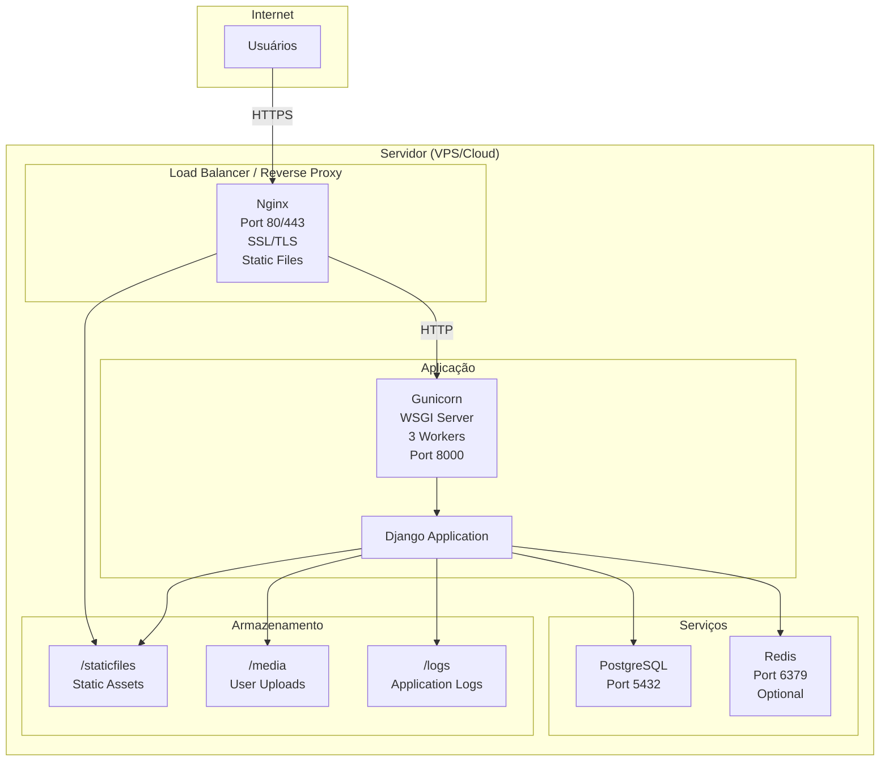
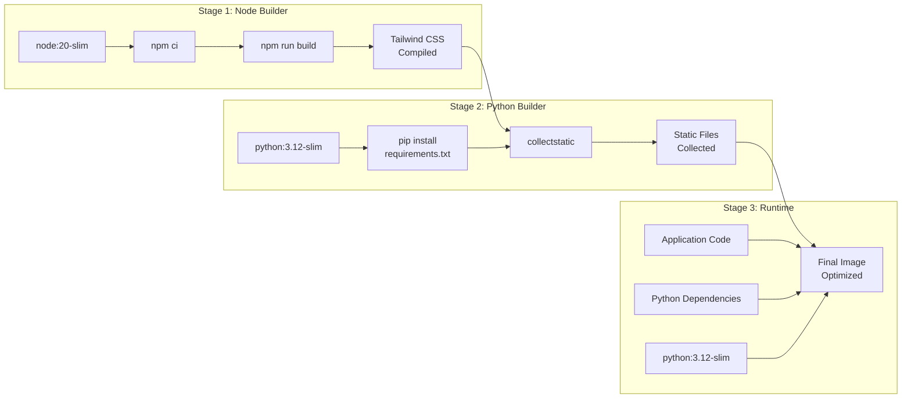
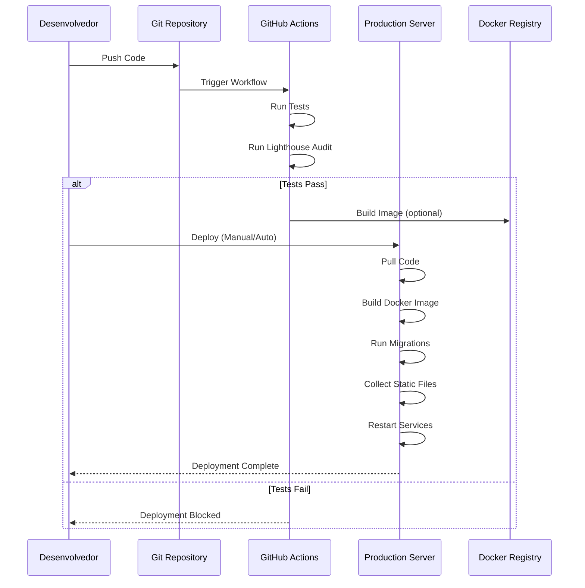
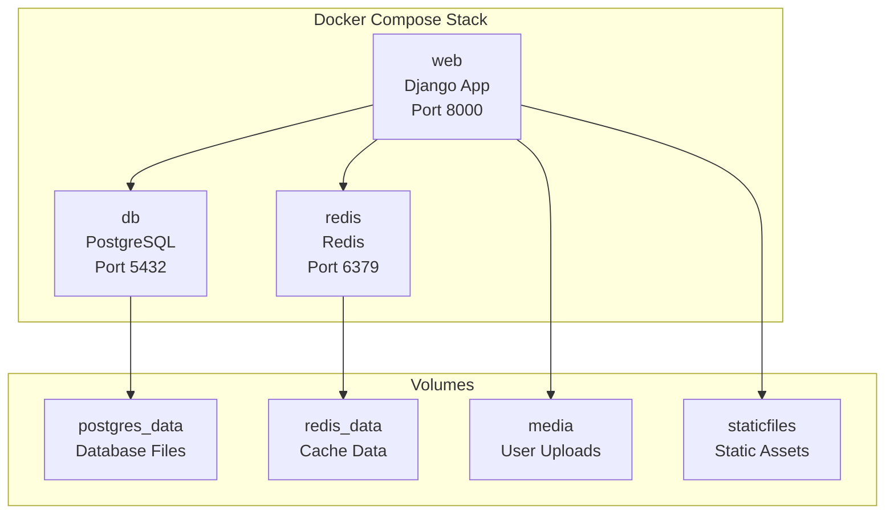
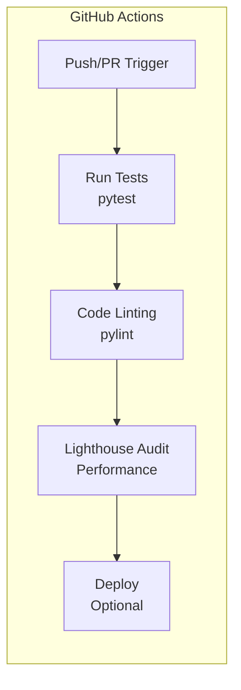

# Arquitetura de Deploy

Este documento descreve a arquitetura de deployment e infraestrutura do UniRV-Django.

## Visão Geral do Deployment

O projeto suporta múltiplos ambientes de deployment:
- **Desenvolvimento**: SQLite, servidor Django, hot-reload
- **Produção**: PostgreSQL, Gunicorn, Nginx, Docker
- **CI/CD**: GitHub Actions para testes e auditorias

## Arquitetura de Produção



## Docker Multi-Stage Build



## Fluxo de Deployment



## Docker Compose (Desenvolvimento/Produção)



## Estrutura de Deployment

### Arquivos de Configuração

```
UniRV-Django/
├── Dockerfile                 # Multi-stage build
├── docker-entrypoint.sh       # Entrypoint script
├── docker-compose.yml         # Docker Compose config
├── .dockerignore             # Docker ignore rules
├── .env.example              # Environment variables template
└── env.production.example     # Production env template
```

### Diretórios de Deployment

```
/var/www/unirv-django/         # Application root
├── .venv/                     # Virtual environment
├── staticfiles/               # Collected static files
├── media/                     # User uploads
├── logs/                      # Application logs
│   ├── django.log
│   ├── security.log
│   └── performance.log
└── .env                       # Environment variables
```

## Configuração de Serviços

### Nginx Configuration

```nginx
server {
    listen 80;
    server_name example.com;
    
    # Redirect HTTP to HTTPS
    return 301 https://$server_name$request_uri;
}

server {
    listen 443 ssl http2;
    server_name example.com;
    
    # SSL Configuration
    ssl_certificate /etc/letsencrypt/live/example.com/fullchain.pem;
    ssl_certificate_key /etc/letsencrypt/live/example.com/privkey.pem;
    
    # Security Headers
    add_header Strict-Transport-Security "max-age=31536000" always;
    
    # Proxy to Gunicorn
    location / {
        proxy_pass http://127.0.0.1:8000;
        proxy_set_header Host $host;
        proxy_set_header X-Real-IP $remote_addr;
        proxy_set_header X-Forwarded-For $proxy_add_x_forwarded_for;
        proxy_set_header X-Forwarded-Proto $scheme;
    }
    
    # Static Files
    location /static/ {
        alias /var/www/unirv-django/staticfiles/;
        expires 1y;
        add_header Cache-Control "public, immutable";
    }
    
    # Media Files
    location /media/ {
        alias /var/www/unirv-django/media/;
        expires 1y;
        add_header Cache-Control "public";
    }
}
```

### Gunicorn Service (systemd)

```ini
[Unit]
Description=UniRV Django Gunicorn daemon
After=network.target

[Service]
User=www-data
Group=www-data
WorkingDirectory=/var/www/unirv-django
ExecStart=/var/www/unirv-django/.venv/bin/gunicorn \
    --bind 127.0.0.1:8000 \
    --workers 3 \
    --timeout 120 \
    --access-logfile /var/www/unirv-django/logs/access.log \
    --error-logfile /var/www/unirv-django/logs/error.log \
    UniRV_Django.wsgi:application
Restart=always

[Install]
WantedBy=multi-user.target
```

## CI/CD Pipeline



### Workflows

1. **test.yml**: Executa testes em cada push/PR
2. **lighthouse.yml**: Executa auditorias Lighthouse CI

## Ambientes

### Desenvolvimento

- **Database**: SQLite (db.sqlite3)
- **Cache**: LocMemCache
- **Server**: `python manage.py runserver`
- **Static Files**: Served by Django
- **Hot Reload**: django-browser-reload

### Produção

- **Database**: PostgreSQL
- **Cache**: Redis (opcional)
- **Server**: Gunicorn + Nginx
- **Static Files**: WhiteNoise ou Nginx
- **SSL**: Let's Encrypt (Certbot)

## Processo de Deploy

### 1. Preparação

```bash
# Coletar arquivos estáticos
python manage.py collectstatic --noinput

# Aplicar migrações
python manage.py migrate

# Verificar configurações
python manage.py check --deploy
```

### 2. Build Docker (se usando)

```bash
docker build -t unirv-django:latest .
```

### 3. Deploy

#### Docker Compose
```bash
docker-compose up -d
```

#### VPS Manual
```bash
# Restart Gunicorn
sudo systemctl restart unirv-django

# Reload Nginx
sudo systemctl reload nginx
```

### 4. Verificação

```bash
# Check service status
sudo systemctl status unirv-django
sudo systemctl status nginx

# Check logs
tail -f /var/www/unirv-django/logs/django.log
```

## Monitoramento

### Logs

- **Application**: `logs/django.log`
- **Security**: `logs/security.log`
- **Performance**: `logs/performance.log`
- **Nginx**: `/var/log/nginx/`
- **Gunicorn**: `logs/access.log`, `logs/error.log`

### Health Check

Endpoint: `/health/`

Retorna status da aplicação e dependências.

## Backup

### Database Backup

```bash
# PostgreSQL
pg_dump -U usuario -d nome_banco > backup_$(date +%Y%m%d).sql

# SQLite
cp db.sqlite3 backup_$(date +%Y%m%d).sqlite3
```

### Media Files Backup

```bash
tar -czf media_backup_$(date +%Y%m%d).tar.gz media/
```

## Escalabilidade

### Horizontal Scaling

- Múltiplos workers Gunicorn
- Load balancer (Nginx ou cloud LB)
- Database replication (PostgreSQL)
- Redis cluster (se usando)

### Vertical Scaling

- Aumentar workers Gunicorn
- Aumentar recursos do servidor
- Otimizar queries do banco

---

**Última atualização**: 2026-01-27
