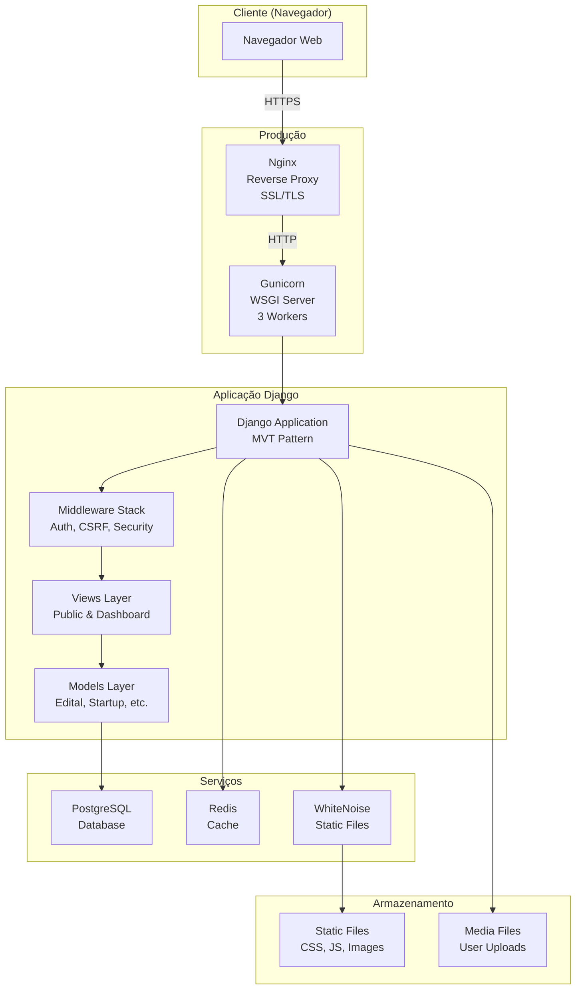
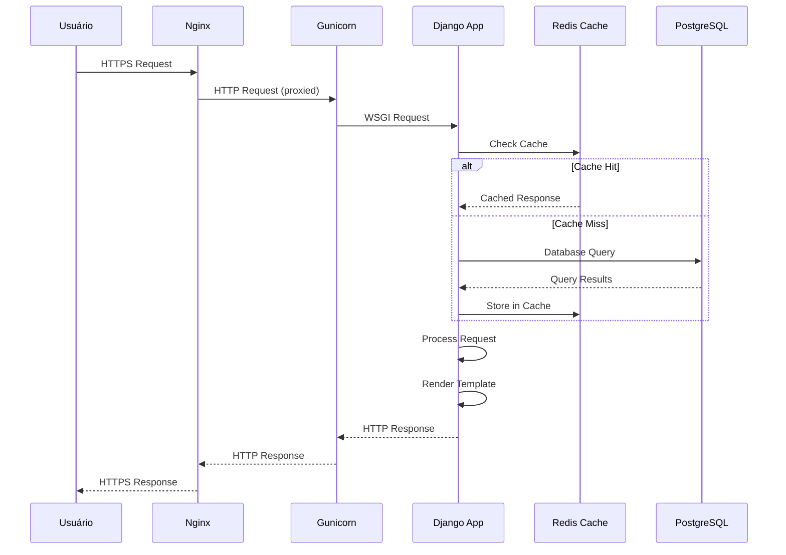
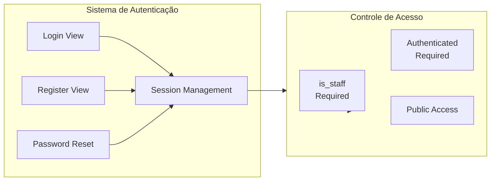

# Arquitetura do Sistema

Este documento descreve a arquitetura geral do sistema UniRV-Django.

## Visão Geral

O UniRV-Django é uma aplicação web Django que segue o padrão MVT (Model-View-Template) e utiliza uma arquitetura em camadas para separar responsabilidades.

## Diagrama de Arquitetura



## Componentes Principais

### 1. Camada de Apresentação (Frontend)

- **Tailwind CSS v4**: Framework CSS utilitário para estilização
- **JavaScript Vanilla**: Interatividade e animações
- **Templates Django**: Renderização server-side com herança de templates

### 2. Camada de Aplicação (Backend)

#### Django Framework
- **Models**: Definição de dados (Edital, Startup, EditalValor, Cronograma, Tag)
- **Views**: Lógica de negócio e processamento de requisições
- **Templates**: Renderização HTML
- **Forms**: Validação e processamento de formulários
- **URLs**: Roteamento de requisições

#### Middleware Stack
1. **SecurityMiddleware**: Headers de segurança (HSTS, X-Frame-Options, etc.)
2. **SessionMiddleware**: Gerenciamento de sessões
3. **AuthenticationMiddleware**: Autenticação de usuários
4. **CSRFMiddleware**: Proteção CSRF
5. **CommonMiddleware**: Funcionalidades comuns
6. **WhiteNoiseMiddleware**: Servir arquivos estáticos

### 3. Camada de Dados

#### Banco de Dados
- **Desenvolvimento**: SQLite
- **Produção**: PostgreSQL com:
  - Connection pooling (CONN_MAX_AGE=600)
  - Full-text search (PostgreSQL)
  - Trigram indexes para busca fuzzy
  - Extensão pg_trgm

#### Cache
- **Desenvolvimento**: LocMemCache (memória local)
- **Produção**: Redis (opcional, recomendado)
- **TTL padrão**: 5 minutos (configurável)

### 4. Camada de Infraestrutura

#### Servidor Web (Produção)
- **Nginx**: Reverse proxy, SSL/TLS, compressão
- **Gunicorn**: Servidor WSGI com 3 workers

#### Arquivos Estáticos
- **WhiteNoise**: Servir arquivos estáticos em produção
- **Collectstatic**: Coleta e minificação de assets

## Fluxo de Requisição



## Autenticação e Autorização



## Estrutura de Diretórios

```
UniRV-Django/
├── editais/              # App principal
│   ├── models.py         # Modelos de dados
│   ├── views.py          # Views principais
│   ├── views/            # Views organizadas
│   ├── forms.py          # Formulários
│   ├── services.py       # Lógica de negócio
│   └── utils.py          # Utilitários
├── UniRV_Django/         # Configurações do projeto
│   ├── settings.py        # Configurações
│   └── urls.py           # URLs raiz
├── templates/            # Templates HTML
├── static/               # Arquivos estáticos
└── theme/                # Tema Tailwind CSS
```

## Tecnologias Utilizadas

### Backend
- **Python 3.12+**: Linguagem principal
- **Django 5.2+**: Framework web
- **PostgreSQL**: Banco de dados (produção)
- **SQLite**: Banco de dados (desenvolvimento)
- **Redis**: Cache (opcional)

### Frontend
- **Tailwind CSS v4**: Framework CSS
- **PostCSS**: Processamento de CSS
- **JavaScript (ES6+)**: Interatividade
- **Terser**: Minificação de JavaScript

### Infraestrutura
- **Gunicorn**: Servidor WSGI
- **Nginx**: Reverse proxy
- **WhiteNoise**: Servir arquivos estáticos
- **Docker**: Containerização

## Segurança

### Medidas Implementadas
- ✅ HTTPS obrigatório em produção
- ✅ Headers de segurança (HSTS, X-Frame-Options, etc.)
- ✅ CSRF protection
- ✅ XSS protection (sanitização HTML)
- ✅ Rate limiting
- ✅ Sanitização de uploads de arquivos
- ✅ Validação de senhas fortes

## Performance

### Otimizações
- ✅ Cache de páginas e consultas
- ✅ Query optimization (select_related, prefetch_related)
- ✅ Índices no banco de dados
- ✅ Minificação de CSS/JS
- ✅ Compressão GZip
- ✅ Connection pooling (PostgreSQL)

---

**Última atualização**: 2026-01-27
